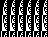

- `rgb.png` a 3x1 R, G, B image
 - `commentFirst.png` a PNG with a comment before Image Header (might be considered invalid)
- `smallest.png` single transparent pixel - as small as possible and entirely being valid
 - `KenSilverman.png` same size but actually displaying a pattern via [clever tricks](http://web.archive.org/web/20070905115613/http://www.jonof.id.au/forum/index.php?topic=934.15#msg5809) !

   
 - `smallest-invalid.png`: same file, with IEND chunk and IDAT CRC32 truncated out.
- `dualPLTE.png` a PNG using 2 palettes (may be considered invalid)
