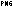
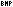

Input files of various file types with self-descriptive contents

Example: The 13x7 PNG image is 85 bytes:

```
000:  89 .P .N .G \r \n ^Z \n 00 00 00 0D .I .H .D .R
010:  00 00 00 0D 00 00 00 07 01 00 00 00 00 FB 0B FA
020:  B7 00 00 00 1C .I .D .A .T 78 DA 63 FC FF 93 59
030:  8A 81 49 F0 03 CB 87 7F 4C 0A 0C 4C 0C 0A 40 11
040:  00 4E C1 07 49 D9 FD D2 02 00 00 00 00 .I .E .N
050:  .D AE 42 60 82
```


and renders as 

zoomed: 

MIT licence.

Useful for basic tests.


# Rules

- should be fully valid
- not empty
- shows what they are (images rendering shows their file types...)
- should be made as small as possible (highly optimized and compressed but not abused)


# Contents

Archives / storage:
- 7-Zip.7z
- arj.arj
- bzip2.bz2
- gzip.gz
- iso.iso
- rar14.rar / rar4.rar / rar5.rar
- tar.tar
- zip.zip


Audio:
- mp3.mp3
- riff.wav / rifx.wav


Documents:
- pdf.pdf
- rich.rtf
- svg.svg


Executables:
- pe32.exe / pe64.exe
- java.class
- wasm.wasm
- mini.swf
- mini.macho
- mini.exe
- mini.elf
- mini.class


Images
- bmp.bmp 
- bpg.bpg
- dicom.dcm
- gif87.gif  / gif89.gif 
- ico.ico 
- jpg.jpg 
- jp2.jp2
- lepton.lep
- png.png 
- tiff-le.tif / tiff-be.tif


Videos
- avi.avi
- flv.flv
- qt.mov
- mp4.mp4
- matroska.mkv
- webm.webm


Script:
- html.htm
- php.php


Misc:
- pcap.pcap / pcapng.pcapng
